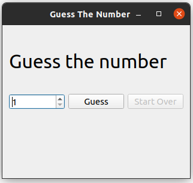
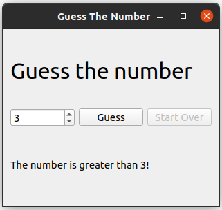
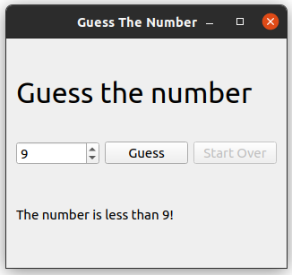
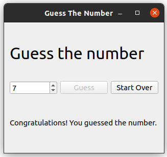

# GuessTheNumber_using_Qt

The program is an example on how to create a widget application in Qt. It is a simple application where it chooses a secret number and asks the user to guess it. The user can
enter the guessed number through a spinBox and click the Guess button. The application will compare the guessed number to the secret number and give the user a hint whether
the secret number is greater or lower than the guessed number. If the user guess the correct number, a message will show up to congratulate the user.

## Used classes
- pushButton
- spinBox
- label
- QWidget

## Running the program
The program is built and run using Qt Creator. 

## Example

